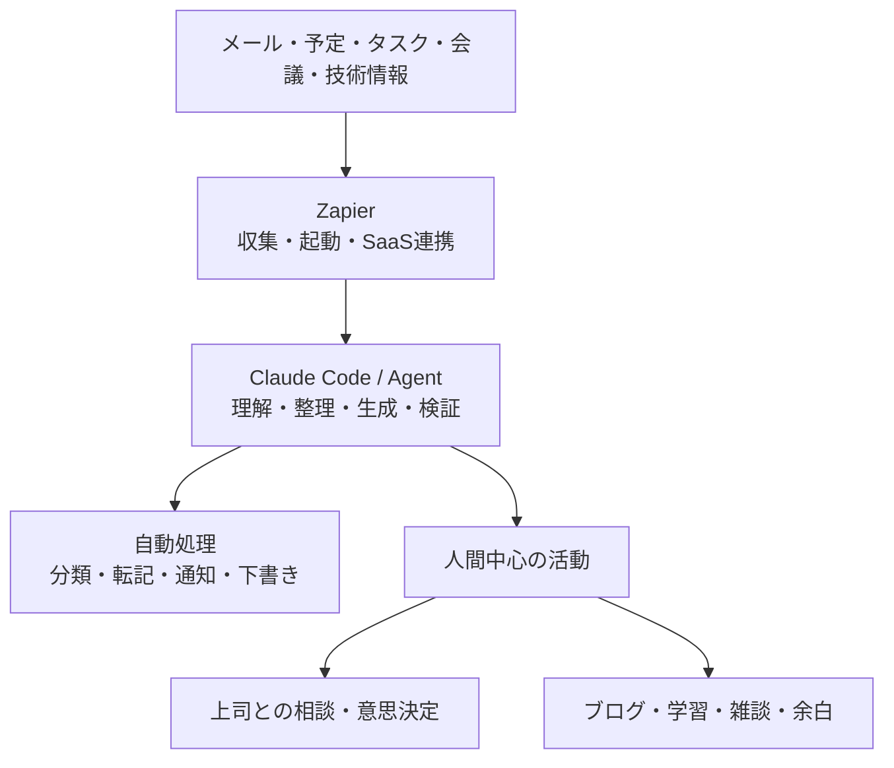

# Claude CodeとZapierによる日常業務OSの取り組み

## 1. 取り組みの概要

これまで、Claude Codeを中心に据え、Zapierを外部サービスとの連携・実行基盤として利用する日常業務の自動化を検討してきた。

目的は、単に処理件数を増やすことではない。メールの仕分け、情報収集、議事録整理、タスク登録などの定型業務を減らし、そこで生まれた時間を、次のような人間にしかできない活動へ再配分することである。

- 上司との相談と意思決定
- チームメンバーとの雑談や関係構築
- 技術調査と深い思考
- はてなブログによる学習成果の発信
- 予定を詰め込まない余白と休憩

この取り組みを、個別の自動化ツールの寄せ集めではなく、仕事の情報を集約し、判断を支援し、実行につなげる「日常業務OS」として構想している。

## 2. 基本方針

役割分担は次のとおりである。

| 領域 | Claude Code | Zapier | 人間 |
|---|---|---|---|
| 曖昧な依頼の理解 | 主担当 | 補助 | 目的を提示 |
| 情報の整理・要約 | 主担当 | データを受け渡す | 内容を確認 |
| 複数ステップの計画 | 主担当 | 定型フローを実行 | 優先順位を決定 |
| コード・ファイル処理 | 主担当 | 起動・連携 | 最終確認 |
| SaaS認証・接続 | 補助 | 主担当 | 権限を承認 |
| イベント検知・定時実行 | 補助 | 主担当 | 条件を決定 |
| メール送信・登録・通知 | 内容を生成 | 実行 | 重要操作を承認 |
| 相談・雑談・意思決定 | 準備を支援 | 時間確保を支援 | 主担当 |

Claude Codeは「考える・生成する・検証する」役割を担い、Zapierは「検知する・つなぐ・実行する」役割を担う。重要な判断、対話、公開、送信は人間が担う。

## 3. 全体アーキテクチャ



Claude Code CLIを常時起動させる前提にはしない。対話型の仕事はClaude CodeからZapier経由で各サービスを操作し、定時実行やイベント駆動の仕事はZapier側からAI処理を起動する。

高度な処理や長時間ワークフローが必要な場合は、サーバー上のAgent SDKや自社API、GitHub Actionsなどを実行基盤として利用する。

## 4. 想定する3つの利用パターン

### 4.1 Claude Codeから業務ツールを操作する

利用者がClaude Codeに指示し、Zapier経由でGmail、Slack、Google Calendar、Notion、Google Driveなどを操作する。

例：

> 今日の予定と重要メールを確認し、優先タスクを5件に整理する。返信が必要なメールは下書きを作成し、承認したものだけタスクとして登録する。

対話しながら実行内容を確認できるため、調査、メール下書き、予定登録、タスク整理などに適している。

### 4.2 Zapierがイベントや時刻を検知して起動する

新着メール、フォーム送信、会議終了、ファイル追加、毎朝8時などを起点に処理する。

```text
イベントまたは時刻
  ↓
Zapierが必要な情報を取得
  ↓
Claudeが分類・要約・下書きを生成
  ↓
ルールとスキーマで検証
  ↓
必要に応じて人間が承認
  ↓
Zapierが登録・通知・保存
```

### 4.3 Agentが複数の業務ツールを横断する

複数の情報源を参照しながら、計画、実行、検証を繰り返す処理である。顧客相談の初動、提案書準備、週次技術レポート、PRの影響分析などに利用する。

ただし、顧客への送信、削除、契約、支払い、権限変更などは自動完結させず、人間の承認を必須とする。

## 5. 日常業務で検討している自動化

| 取り組み | 起点 | Claude Codeの役割 | Zapierの役割 | 人間の役割 |
|---|---|---|---|---|
| 朝の業務ブリーフ | 毎朝 | 情報を統合し優先順位案を作成 | メール・予定・タスクを収集し配信 | 今日の方針を決定 |
| メール仕分け | 新着メール | 緊急度、案件、要返信を分類 | ラベル付け、通知、タスク登録 | 例外を確認 |
| メール返信支援 | 要返信メール | 文脈を踏まえた返信案を生成 | Gmailなどへ下書きを保存 | 内容を修正して送信 |
| 会議後処理 | 会議終了・議事録追加 | 決定事項、担当、期限、リスクを抽出 | 保存、タスク作成、通知 | 認識のずれを確認 |
| 顧客相談の初動 | フォーム・メール | 課題分類、確認質問、提案骨子を作成 | CRM登録、担当割当 | 顧客対応方針を判断 |
| 提案書準備 | 案件状態の変更 | 過去資料から構成案を作成 | フォルダ・文書作成、通知 | 主張と提案内容を決定 |
| 技術調査 | RSS・URL・論文登録 | 要約、比較、技術評価 | 情報を蓄積し定期配信 | 独自の評価を加える |
| テックリード週報 | 毎週 | 成果、課題、リスク、次の行動を整理 | 情報収集、文書作成、共有 | 内容と優先順位を確定 |
| PR・Issue連携 | GitHubイベント | 変更影響やレビュー観点を整理 | Issue更新、通知 | レビューとマージ判断 |
| 作業日記 | 毎日夕方 | 予定、コミット、タスクから日報を生成 | DocsやNotionへ保存 | 振り返りを追記 |
| 請求書処理 | 添付ファイル受信 | 項目抽出、不足・異常を検査 | 保存、台帳登録、承認依頼 | 金額と支払いを承認 |
| 定期レポート | 週末・月末 | 変化、原因仮説、次の行動を生成 | データ取得、保存、配信 | 解釈と意思決定 |

## 6. 自動化しないが、意図的に確保する活動

自動化の成果は、空いた時間にさらにタスクを詰め込むことではなく、相談、発信、関係構築、思考の時間を生み出すことにある。

### 6.1 はてなブログの更新

ブログ執筆そのものを全自動化するのではなく、素材の収集と下書きをAIに支援させ、最終的な主張と公開判断は自分で行う。

```text
技術記事・論文・業務メモを収集
  ↓
Claudeがテーマ候補と構成案を作成
  ↓
Markdownの下書きを生成
  ↓
自分の経験・主張・評価を追記
  ↓
事実・リンク・機密情報を確認
  ↓
手動で公開
```

主な発信テーマは次のとおりである。

- AI Agent、RAG、LLMOps
- AI Coding Agentとハーネスエンジニアリング
- Clojureと自己進化Agent
- Enterprise OS、Agent Factory、Decision OS
- VLA、JEPA、World Model、ロボット研究
- 論文を読んで実装・検証した記録
- テックリードとしての学び

AIが書いた一般論ではなく、自分が経験したこと、判断したこと、試した結果を記事の中心にする。

### 6.2 上司との相談

相談そのものは自動化しない。Claude Codeには、相談に必要な事実、論点、選択肢の整理を支援させる。

```markdown
# 上司への相談メモ

## 結論
何を判断・支援してほしいか

## 背景
現在の状況と、なぜ相談が必要か

## 観察事実
数値、進捗、発生した事象

## 自分の見立て
原因、リスク、機会

## 選択肢
- 案A
- 案B
- 案C

## 推奨案
推奨理由とトレードオフ

## お願いしたいこと
判断、調整、紹介、予算、優先順位の変更など
```

1on1や定例会議の前に、GitHub、議事録、タスク、日報から相談候補を抽出する。ただし、生成された文章を読み上げるためではなく、対話の質を上げる準備として利用する。

### 6.3 雑談時間

雑談は、単なる休憩ではなく、信頼関係の形成、暗黙知の共有、小さな違和感の発見につながる。したがって、空き時間をすべて集中作業や会議で埋めず、1日15〜30分程度の雑談や気軽な相談の時間を確保する。

自動化で行うのは、カレンダー上の余白確保や、話しておきたい相手・テーマの提示までとする。会話自体は予定調和にせず、人間同士の自然な対話を重視する。

### 6.4 隙間時間と余白

隙間時間は、AIが自動的に次のタスクを割り当てる時間にはしない。休憩、散歩、読書、考え事なども正当な選択肢として扱う。

空き時間がある場合は、次のような候補を提示するだけにする。

```text
15分の空き時間があります。

1. 何もしない・休憩する
2. 同僚と雑談する
3. 上司への相談事項を1件整理する
4. ブログメモを100〜200字だけ書く
5. 軽いタスクを1件処理する
```

目安として、次の時間を守る。

- 1日15〜30分：雑談、気軽な相談
- 会議間10〜15分：整理、移動、休憩
- 1日30〜60分：予定を入れないバッファ
- 週1回60〜90分：技術調査またはブログ執筆
- 週1回30分：上司への相談事項の整理

## 7. 毎朝の業務ブリーフ

最初に実装するMVPとして、毎朝の業務ブリーフを想定している。

```markdown
# 本日の業務ブリーフ

## 1. 今日の重要事項
- 最重要タスク
- 締切
- 返信が必要なメール
- 会議と準備事項

## 2. 上司に相談すること
- 判断してほしいこと
- 自分だけでは解決できない障害
- 技術・組織上のリスク
- 提案したい改善事項

## 3. 技術発信
- はてなブログの候補
- 今日追記できるメモ
- 今週公開予定の記事
- 参考資料と自分の経験

## 4. 人との時間
- 雑談・情報交換の時間
- 話しておきたい人
- チーム内で気になっていること

## 5. 余白
- 予定を入れない時間
- 集中作業時間
- 休憩・散歩・読書
```

処理の流れは次のとおりである。

```text
毎朝の定刻
  ↓
Zapierがメール・予定・タスク・技術メモを収集
  ↓
Claudeが業務ブリーフを生成
  ├─ 今日の優先タスク
  ├─ 返信が必要なメール
  ├─ 上司への相談候補
  ├─ ブログ候補
  ├─ 雑談・情報交換の候補
  └─ 守るべき余白時間
  ↓
本人が予定と優先順位を決定
```

## 8. Claude Code側の設計

Claude Code側には、判断や業務知識を集約する。

| 構成要素 | 役割 |
|---|---|
| `CLAUDE.md` | 全体方針、業務原則、禁止事項 |
| Skills | メール処理、議事録処理、ブログ作成、週報作成など |
| JSON Schema | 入力・出力形式と必須項目の固定 |
| Python / TypeScript | 計算、検証、データ変換、外部API処理 |
| Tests | 代表ケース、境界値、失敗ケースの確認 |
| Hooks | 処理前後の検査、ログ記録、機密情報の確認 |

Zapier側には、Trigger、Filter、Paths、OAuth認証、SaaSアクション、スケジュール、リトライ、承認、通知、実行履歴を担当させる。

## 9. 安全設計

最初から、AIが自由に外部サービスへ書き込める状態にはしない。

- メールは自動送信せず、最初は下書きまでとする
- 顧客向け送信、削除、契約、支払い、権限変更は人間承認を必須にする
- 読み取り権限と書き込み権限を分離する
- 必要なアクションだけをAIに公開する
- `allow`、`ask`、`deny`でツール権限を制御する
- 二重登録を防ぐ冪等性キーを持たせる
- 入力、判断、承認、実行結果を記録する
- 個人情報や機密情報を外部モデルへ渡す前に検査する
- タイムアウト、最大試行回数、失敗通知を設定する
- ブログ公開前に会社・顧客・研究上の機密情報を確認する
- 予定の自動登録によって余白時間を侵食しない

## 10. 導入ステップ

### フェーズ1：読み取りと下書き

- メール、予定、タスクの取得
- 毎朝の業務ブリーフ作成
- メール返信案の作成
- 上司への相談候補の抽出
- ブログテーマと構成案の作成

### フェーズ2：承認付き登録

- 承認後のタスク登録
- 議事録から担当・期限を登録
- ブログ下書きをMarkdownで保存
- 週報や日報を文書として保存

### フェーズ3：限定的な自動実行

- 低リスクな通知と定型登録を自動化
- 失敗時のリトライとエスカレーションを実装
- ログと評価結果からワークフローを改善

### フェーズ4：日常業務OSへの拡張

- 業務横断のコンテキスト管理
- 長期的な目標と日々のタスクの接続
- 技術発信、相談、学習、関係構築を含む時間配分の支援
- 個人向けの仕組みを、チーム運営やAgent Factoryへ展開

## 11. 評価指標

自動化率だけでなく、仕事の質と時間の使い方を評価する。

| 観点 | 指標例 |
|---|---|
| 効率 | 1週間当たりの削減時間、自動処理完了率 |
| 品質 | 人間による修正率、誤分類・誤登録件数 |
| 安全性 | 誤送信、権限逸脱、機密情報流出の件数 |
| コスト | 1回当たりのZapier・LLMコスト |
| 意思決定 | 相談から判断までの時間、手戻り件数 |
| 発信 | ブログ下書き数、公開本数、再利用できた知識 |
| チーム | 雑談・相談時間、早期に発見できた課題 |
| 持続性 | 余白時間、集中時間、予定超過の頻度 |

## 12. まとめ

この取り組みでは、Claude Codeを「判断・生成・検証を担う頭脳」、Zapierを「SaaS間のイベント連携と定型処理を担う実行基盤」として位置付ける。

目指すのは、あらゆる仕事の完全自動化ではない。機械に任せられる処理を減らし、上司との相談、チームとの雑談、技術発信、学習、深い思考、休息に時間を戻すことである。

まずは、読み取り中心で安全性の高い「毎朝の業務ブリーフ」から開始する。その後、承認付きの登録や通知へ段階的に広げ、最終的には、個人とチームの判断と行動を支援する日常業務OSへ発展させる。
